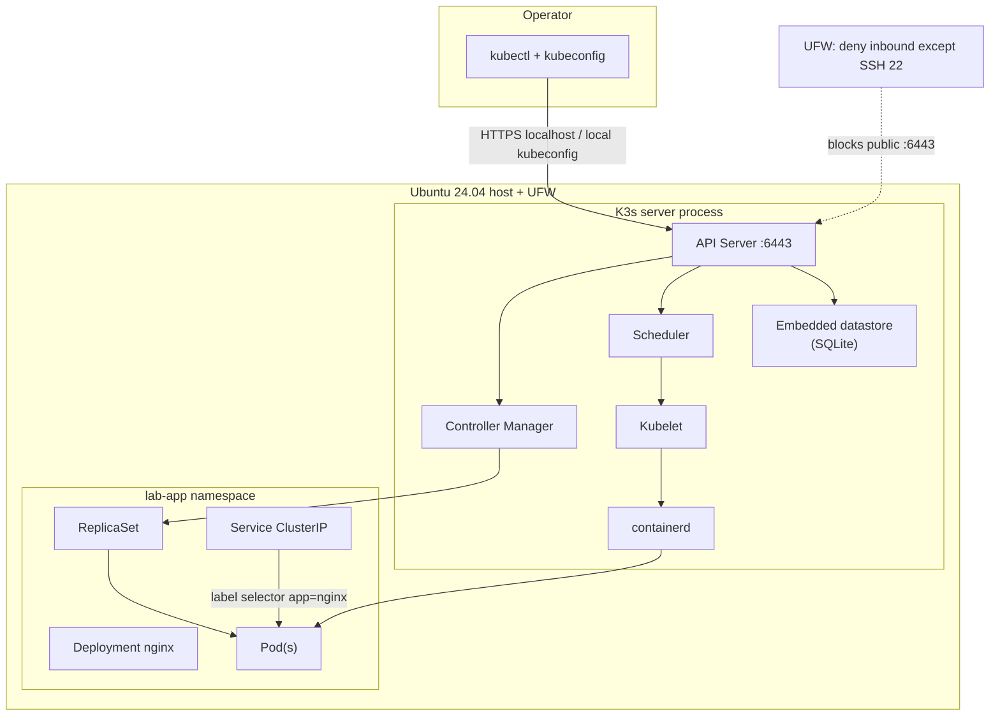

# Phase 1 — Kubernetes foundations (K3s)

## Why Kubernetes exists

Modern applications are packaged as containers, but running containers alone does not solve scheduling, failure recovery, configuration drift, or controlled change. Operators still need a consistent way to declare **desired state** (how many copies, which image, which network identity) and have a control plane continuously reconcile the live cluster toward that state.

Kubernetes provides:

- A declarative API for workloads and cluster resources
- Controllers that self-heal toward desired replicas and configuration
- Scheduling across nodes (even when there is only one)
- Service discovery and stable virtual networking for Pods
- Rolling updates and rollbacks without reinventing deployment tooling

From a security engineering perspective, Kubernetes is also a **new trust boundary and attack surface**: anyone who can talk to the API server can create privileged Pods, read Secrets, or pivot through the cluster network—unless RBAC, admission, network policy, and audit controls constrain that power. Phase 1 intentionally introduces the platform *before* those controls so later phases harden a system you already understand.

## Why K3s

This lab runs on a single temporary DigitalOcean VPS. Full upstream Kubernetes (kubeadm + etcd + separate control-plane binaries) is heavier than needed for a foundations lab.

**K3s** is a CNCF-conformant Kubernetes distribution optimized for constrained environments:

| Factor | Why it fits this lab |
|--------|----------------------|
| Single binary / simple install | Official `get.k3s.io` installer; fast to stand up and tear down |
| Embedded datastore | SQLite by default on single-node (no external etcd ops in Phase 1) |
| Bundled runtime | containerd included; no separate Docker daemon required |
| Lightweight defaults | Smaller footprint on a ~2 vCPU / ~4 GiB droplet |
| Same Kubernetes API | Concepts transfer to managed or full kubeadm clusters |

K3s still exposes the same core objects (Pods, Deployments, Services, Namespaces) and the same security concerns (API server, kubelet, CNI, ServiceAccounts). Choosing K3s is an operational convenience, not a security exemption.

## Architecture (this lab)



### Control plane and node components

| Component | Role | Security note |
|-----------|------|----------------|
| **API Server** | Front door for all cluster state changes; authenticates/authorizes requests | Highest-value target; must not be public without strong authz |
| **Scheduler** | Assigns Pods to Nodes based on resources and constraints | Compromised scheduling can place workloads poorly; less direct than API abuse |
| **Controller Manager** | Runs controllers (Deployment, ReplicaSet, Node, etc.) that reconcile desired vs actual | Implements self-healing; bad desired state → automated bad actual state |
| **Embedded datastore** | Persists cluster state (K3s single-node: SQLite) | Confidentiality/integrity of etcd/SQLite = confidentiality of Secrets and RBAC |
| **Kubelet** | Node agent; starts containers per PodSpecs from the API | Node compromise ≈ ability to run arbitrary containers as configured |
| **Container runtime** | containerd executes containers | Image provenance and runtime privileges matter later (PSA, seccomp, etc.) |
| **kubectl** | CLI client for the API | Credentials in kubeconfig are equivalent to cluster admin in default K3s |
| **kubeconfig** | Cluster endpoint, CA, client cert/token | Never commit; treat like a root password for the cluster |

### Core objects exercised in Phase 1

| Object | Meaning in this lab |
|--------|---------------------|
| **Node** | `k8s-security-lab` — Ready control-plane + worker (single node) |
| **Namespace** | `lab-app` — isolation boundary for names and (later) policies |
| **Pod** | Smallest deployable unit; one nginx container here |
| **ReplicaSet** | Keeps N Pods matching a template alive |
| **Deployment** | Owns ReplicaSets; enables rolling updates and rollbacks |
| **Service** | Stable ClusterIP + DNS name selecting Pods by labels |
| **Labels / selectors** | `app: nginx` binds Deployment → Pods and Service → Pods |

### Desired state, reconciliation, and self-healing

You declare desired state (e.g., `replicas: 1`, `image: nginx:1.27.4`). Controllers continuously compare live objects to that desire and act:

1. **Scale 1→3 / 3→1** — Deployment updates `replicas`; ReplicaSet creates or terminates Pods until counts match.
2. **Delete a Pod** — ReplicaSet notices `current < desired` and creates a replacement. That is reconciliation / self-healing, not magic immortality of a specific Pod name.
3. **Rolling update** — Deployment creates a new ReplicaSet with the new Pod template (`nginx:1.28.0`) and shifts replicas gradually (`maxUnavailable: 0`, `maxSurge: 1`).
4. **Rollback** — `kubectl rollout undo` moves the Deployment back to the previous revision’s template; a new rollout revises history again.

## Installation summary

- Method: official `curl -sfL https://get.k3s.io | sh -`
- Version installed: **v1.36.2+k3s1** (stable channel at install time)
- Service: `k3s.service` enabled and active
- kubectl: symlink to `k3s`; kubeconfig copied from `/etc/rancher/k3s/k3s.yaml` to `~/.kube/config` (mode `600`, not committed)
- Workload: declarative manifests under `manifests/lab-app/`

### Pre-install Phase 0 verification (intact)

| Control | Result |
|---------|--------|
| SSH key-only / no root / no password auth | Confirmed via `sshd -T` |
| UFW active, SSH 22 only | Confirmed |
| Fail2ban active (`sshd` jail) | Confirmed |
| unattended-upgrades active | Confirmed |
| API :6443 not listening before install | Confirmed |

### Post-install API exposure

K3s listens on `*:6443`, but **UFW does not allow 6443**. Default incoming deny keeps the API off the public internet. Operator access is local (SSH to the host, then kubectl with local kubeconfig). No Ingress, LoadBalancer, or NodePort was opened for nginx (ClusterIP only).

## Commands used

```bash
# Phase 0 re-check
sudo ufw status verbose
sudo sshd -T | grep -E 'permitrootlogin|passwordauthentication'
systemctl is-active fail2ban unattended-upgrades

# Install
curl -sfL https://get.k3s.io | sudo sh -
sudo systemctl status k3s
mkdir -p ~/.kube && sudo cp /etc/rancher/k3s/k3s.yaml ~/.kube/config
sudo chown "$USER:$USER" ~/.kube/config && chmod 600 ~/.kube/config
export KUBECONFIG=~/.kube/config

# Cluster health
kubectl get nodes
kubectl version
kubectl cluster-info

# Deploy
kubectl apply -f manifests/lab-app/
kubectl get all -n lab-app
kubectl describe deployment nginx -n lab-app
kubectl describe pod -n lab-app -l app=nginx
kubectl get rs -n lab-app

# Exercises
kubectl scale deployment/nginx -n lab-app --replicas=3
kubectl scale deployment/nginx -n lab-app --replicas=1
kubectl delete pod <pod> -n lab-app          # ReplicaSet recreates
kubectl set image deployment/nginx nginx=nginx:1.28.0 -n lab-app
kubectl rollout status deployment/nginx -n lab-app
kubectl rollout undo deployment/nginx -n lab-app
kubectl rollout history deployment/nginx -n lab-app

# Troubleshooting toolkit
kubectl get ...
kubectl describe ...
kubectl logs ...
kubectl explain deployment.spec.replicas
kubectl rollout status|undo|history ...
```

## Security implications (Phase 1)

### New attack surface introduced

- **Kubernetes API server** (even if firewalled): powerful if reachable with stolen kubeconfig or weak authz
- **Kubelet** and **containerd** on the node
- **CNI / pod network** (Flannel in K3s defaults): east-west traffic between Pods is open by default
- **ServiceAccounts** mounted into Pods (default token projection) — useful for apps, dangerous if RBAC is loose
- **Images from registries** (nginx from Docker Hub): supply-chain trust
- **Host ↔ cluster** relationship: node admin ≈ cluster admin on single-node K3s

### Why later controls matter (deferred)

| Control | Why needed | Phase |
|---------|------------|-------|
| **RBAC** | Default K3s admin kubeconfig is all-powerful; workloads and humans need least privilege | Later |
| **Pod Security** | Stop privileged/hostPath/hostNetwork Pods by default | Later |
| **NetworkPolicies** | Default allow-all pod networking enables lateral movement | Later |
| **Audit logging** | Reconstruct who changed cluster state after an incident | Later |

Phase 1 does **not** implement RBAC hardening, NetworkPolicies, Pod Security Admission, Falco, Helm, Ingress, Load Balancers, multi-node, GitOps, or observability stacks.

## Common interview questions (with short answers)

1. **What is desired state?** The configuration you declare (replicas, image, labels). Controllers reconcile actual state toward it.
2. **Pod vs Deployment?** A Pod is one running instance; a Deployment manages ReplicaSets/Pods for updates and declared replica counts.
3. **What happens if you delete a Pod owned by a ReplicaSet?** The ReplicaSet creates a new Pod to restore the desired count.
4. **How does a Service find Pods?** Label selectors (here `app=nginx`), not Pod names or IPs.
5. **Rolling update vs recreate?** Rolling gradually shifts traffic/replicas to a new ReplicaSet; recreate tears down then creates (more downtime).
6. **What is kubeconfig?** Client credentials and API endpoint used by kubectl—treat as a secret.
7. **Why is the API server sensitive?** It is the authorization point for nearly all cluster mutations and reads.
8. **K3s vs “full” Kubernetes?** Same API; K3s packages components for lighter ops (embedded datastore, single process packaging).

## Lessons learned

- Declarative manifests should apply **namespace before namespaced objects** (numeric prefixes avoid alphabetical race: `deployment.yaml` before `namespace.yaml`).
- Imperative exercises (`kubectl scale`, `kubectl set image`, `rollout undo`) change live state; keep Git manifests as the documented baseline (`nginx:1.27.4`, 1 replica) after demos.
- Self-healing restores **counts and templates**, not specific Pod names or IPs.
- Host firewall posture from Phase 0 still matters after K3s: leave **6443 closed** on UFW unless you intentionally expose the API to trusted admins.
- `kubectl explain` is the built-in API documentation when learning fields without leaving the cluster.

## Validation checklist

| Check | Status |
|-------|--------|
| K3s running | Pass |
| Node Ready | Pass |
| Namespace `lab-app` created | Pass |
| Deployment healthy (1/1) | Pass |
| ReplicaSet healthy | Pass |
| Service healthy (ClusterIP) | Pass |
| Scaling 1→3 and 3→1 | Pass |
| Pod recreation after delete | Pass |
| Rolling update | Pass |
| Rollback | Pass |
| API server not publicly allowed in UFW | Pass |
| Phase 0 SSH / Fail2ban / unattended-upgrades intact | Pass |

## Evidence

Sanitized command outputs: `evidence/phase-01/`
